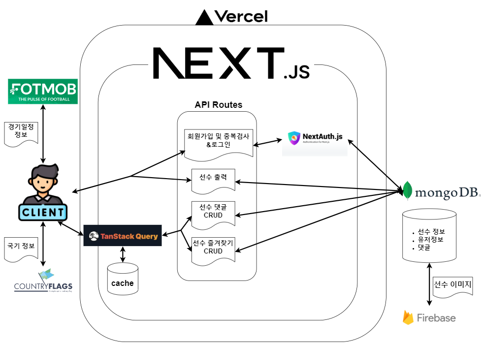
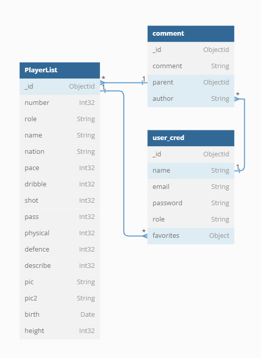

# ALLTHATARSENAL

### NEXT.js를 활용한 아스날FC 팬 페이지

<!--  -->

## 📝 프로젝트 소개

NEXT.js를 활용한 아스날FC 팬 페이지입니다. 여러 토이 프로젝트를 하였지만 대부분 단편적으로 끝나는 경우가 많았고, 그 프로젝트를 더 이상 디벨롭하지 못해 아쉬웠던 경험이 있었습니다. 하나의 서비스를 만든다라고 생각하고, 제가 학습한 것들로 꾸준히 코드 개선을 하려는 의도로 프로젝트를 시작했습니다.

## 🛠️ 기술 스택

<!--
  Shield.io 배지 양식

  

  - 라벨: 임의의 이름
  - 색상: https://simpleicons.org/ 에서 검색한 로고의 색상코드 (# 제외하고 입력)
  - 배지 스타일: plastic, flat, flat-square, for-the-badge, social 중 하나 선택
  - 로고 이름: https://simpleicons.org/ 에서 검색한 로고의 이름
  - 로고 색상: 로고의 색상코드
-->
<p>
<!-- npm -->

<!-- NEXT.js -->

<!-- ReactQuery -->

<!-- NextAuth -->

<!-- NEXTUI -->

<!-- MongoDB -->

<!-- Firebase -->

<!-- Swiper -->

<!-- Typescript -->

<!-- Vercel -->

<!-- Recharts-->

<!-- emotion -->

<!-- Fullcalender -->


</p>
  <!--  -->
  
## 🆕 구현 기능

<!--  -->

#### 1. NextAuth를 활용한 회원가입 및 로그인&로그아웃 기능.

- 회원가입, 이메일 중복검사 및 비밀번호 유효성검사를 클라이언트와 서버단에서 시행.
- API routes로 회원정보 DB에 전달.
- NextAuth로 로그인과 로그아웃 기능 구현.
- NextAuth를 활용한 인가 페이지(마이페이지) 구현

#### 2. mongoDB에서 선수 목록 출력 및 선수별 정렬

- 데이터 베이스는 mongoDB로 관리.선수데이터, 유저정보 및 댓글 저장.
- 선수데이터, 유저정보등은 NEXT.js에서 직접 데이터 페칭
- 이미지는 Fireabase storage에서 관리

#### 3. 선수 상세 정보 출력 및 선수당 댓글 출력,작성,수정,삭제기능 구현.

- 데이터의 변화가 적은 선수 정보,로그인은 NEXT.js에서 직접 데이터 페칭
- 각 선수별 댓글,즐겨찾기와 같은 개인화된 기능은 client-side에서 관리하기 위해 TanstackQuery를 활용하여 데이터페칭.
- 댓글 및 즐겨찾기 기능은 NextAuth로 인가 받지 못하면 기능 사용 불가.

#### 4. Recharts를 활용한 선수간 스탯 비교 기능 구현

- NEXT.js에서 가져온 선수 스탯 데이터를 Recharts로 시각화하여 선수간 스탯비교 기능을 구현.
- Recharts는 선수 상세페이지에서도 사용

#### 5. FullCalendar와 fobmobAPI를 활용한 경기 일정관리.

- fobmobAPI의 경기일정 데이터를 FullCalendar로 구현하여 경기일정을 시각화.

<!--  -->
<br />

## 🔃 프로젝트 흐름도



## 💿 데이터 베이스



## ❓ 기술의 이유

### 1. data fetching을 두가지로 한 이유.

TanstackQuery와 Next.js의 서버 컴포넌트를 나누게된 이유는 개인화된 요청이냐 아니냐에 따라 나뉘게 되었습니다.

#### 1-1) TanstackQuery

이 프로젝트에서 즐겨찾기와 같은 개인화된 요청이 있습니다.개인화된 요청은 서버에 캐싱되면 안됩니다.그래서 fetch를 사용할 때 no-store 옵션을 설정하여 사용하는 방법도 고려했지만
이 경우, 새로고침 및 라우트 캐시가 만료될 때 마다 API 호출이 발생한다는 단점이 발생했습니다.

그래서 client-side에서 tanstack-query를 사용하여 브라우저 메모리에 개인화된 요청에 대한 응답을 캐시 하고 queryKey와 staleTime으로 캐시를 관리하는 방법을 사용했습니다.
또한 개인화된 요청의 경우 검색 엔진에 노출될 필요가 없으므로 SEO를 고려하지않고 client-side에서 tanstack-query로 요청 후 캐시를 관리하였습니다.

#### 1-2) Next.js의 서버 컴포넌트

Next.js의 서버 컴포넌트는 RSC에 기반하고 있습니다. 그것에 대한 장점으로는

- 데이터 페칭 로직을 서버로 옮길 수 있어, DB와 더 가까이에서 처리할 수 있다.

- 번들사이즈가 클라이언트에 영향을 주지 않게할 수 있다.

등이 있었습니다.
또한 Next.js의 서버 컴포넌트로 데이터 페칭을 한 데이터가 정적인 데이터인 선수 정보였기 때문에, Next.js의 서버 컴포넌트로 데이터 페칭을 실행하였습니다.

### 2. next/image를 쓰지 않은 이유.

next/image를 사용했을 때 장점이 3가지 있었습니다.

1. 자동 최적화 : 빌드 시 이미지를 자동으로 최적화.이미지 크기를 미리 줄여주어 사용자의 이미지 로딩 시간을 단축

2. 지연 로딩 : 초기 페이지 로드 시 필요하지 않은 리소스를 로드하지 않음으로써 성능을 향상

3. 자동 캐싱 : 서버에서 이미지 크기를 자동으로 조절하고 캐싱

등이었고 프로젝트 초창기때 저 역시도 next/image 사용하였습니다.

하지만 next/image는 서버 리소스를 사용하며, 이미지 프로세싱에 들어가는 컴퓨팅 리소스가 작지 않았으며,또한 next/image를 사용했을때 몇가지 고려할 사항들이 있었습니다.

- 서버부하:next/image 의 자동 이미지 최적화 기능은 수많은 이미지를 처리할 때 서버 리소스 사용량을 증가시킬 수 있다고 판단했습니다.

- 중복 :이미 외부 CDN을 통해 이미지 최적화와 캐싱하고 있을시(본 프로젝트에서는 Firebase Storage를 쓰고 있습니다.),next/image가 제공하는 기능과 중복될 수도 있다고 판단했습니다.

저는 next/image가 가지는 장점에도 불구하고 서버부하, 외부 CDN과 기능이 중복된다는 단점을 상쇄시키지 못한다고 생각하여 다시 img태그를 사용하기로 했습니다.

### 3.TailwindCSS & NEXT UI를 사용한 이유

#### 3-1) TailwindCSS

- TailwindCSS는 제로 런타임으로 (런타임에 CSS를 계산할 필요가 없으므로 페이지 로딩 속도가 향상됩니다.)동작하며 빠르다는 장점이 있었습니다.

```
제로런타임

브라우저가 페이지를 렌더링할 때 실제로 사용되는 스타일만 포함하는 최적화된 CSS 파일을 빌드 타임에 생성
```

- CSS 번들 크기를 줄여준다.: 실제로 사용되는 스타일만 포함되므로 CSS 번들 크기가 줄어듭니다.

물론 tailwind를 쓰는 데 단점들도 존재 했으나 위와 같은 장점과 상대적으로 쓰기 쉽고, 반응형을 구성하는데에 편했기에 사용하게 되었습니다.

#### 3-2) NextUI

- NextUI는 TailwindCSS를 스타일 엔진으로 사용하는데, NextUI 컴포넌트 내에서 모든 TailwindCSS 클래스를 사용할 수 있어서 tailwind TailwindCSS와 연계가 좋았습니다.
- NextUI는 tailwind-variants라는 TailwindCSS 유틸리티 라이브러리를 만들어 TailwindCSS 클래스 충돌을 자동으로 처리하고 관리합니다.
- 마지막으로 컴포넌트 자체가 깔끔하고 예뻤기 때문에 사용하게 되었습니다.다.

## 🕹️ 실행 방법

```sh
$ git clone https://github.com/theo-jin/allthatarsenal.git
$ npm install
$ npm run dev
```

<!--  -->
<br />

## 🔗 배포 링크

https://allthatarsenal-orbi.vercel.app/

<!--  -->
<br />

## 🖱️ 기능

#### 테스트를 위해 로그인하시길 바랍니다.

```
id:asdf@asdf.com
pw:asdfasdf
```

### SwiperReact를 이용한 스크롤


### mongoDB에서 선수 목록 출력 및 생성및 선수별 정렬


### fobmobAPI와 Fullcalender를 통한 일정표시


### Recharts를 활용한 선수간 스탯 비교 기능 구현


