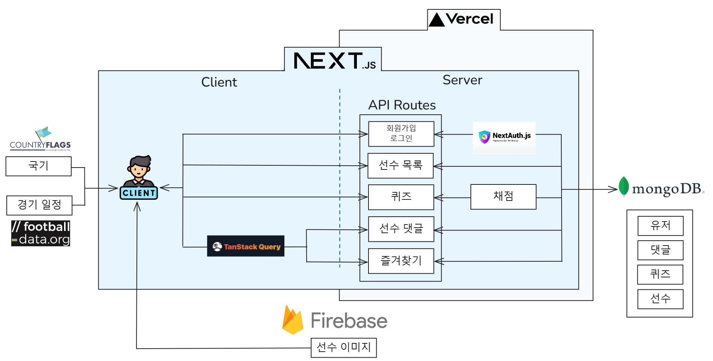

# ALLTHATARSENAL

### NEXT.js를 활용한 아스날FC 팬 페이지

## 프로젝트 소개

이 프로젝트는 Next.js를 기반으로 제작된 아스날 FC 팬 페이지입니다. NoSQL 데이터베이스를 활용하여 선수 정보를 관리하며, 사용자들이 선수별 즐겨찾기 기능, 댓글 작성, 경기 일정 확인 등의 서비스를 이용할 수 있도록 구현하였습니다.

이 페이지는 단순한 토이 프로젝트를 넘어서, 하나의 완성된 서비스를 목표로 꾸준히 개선하고자 시작한 프로젝트입니다. 이전의 프로젝트들이 단편적으로 끝난 아쉬움을 반영하여, 이번에는 학습한 내용을 지속적으로 적용하고 발전시키려는 의도를 담고 있습니다.

## 기술 스택

<p>


  


</p>

## 구현 기능

### 공통 페이지 및 데이터 관리

- 전 페이지 TailwindCSS와 NextUI를 이용한 반응형 디자인 적용.
- MongoDB로 선수 data, 유저 정보, 댓글, 퀴즈 정답 관리.
- MongoDB로 유연한 스키마로 변경사항 대응.(v.1.1.0에서 quizResult 스키마추가)
- Firebase Storage로 선수 이미지 및 홈 화면 이미지 관리

### 회원가입 및 로그인 페이지

- NextAuth로 로그인, 로그아웃 기능 구현.API Routes로 회원 등록 및 이메일 중복 검사 기능

### 선수 리스트 페이지 & 선수 비교 페이지

- Next.js 서버 컴포넌트에서의 data fetch를 이용한 서버캐시 활용 및 공통된 요청 처리. Recharts로 선수간 스탯 비교 시각화.

### 선수 상세 페이지 & 마이 페이지 : 댓글 및 즐겨찾기 기능

- 댓글 기능: NextAuth의 authOptions로 사용자 인가관리. 인가시 등록, 수정 및 삭제 가능, Admin 계정은 모든 댓글 삭제 가능.
- 즐겨찾기 기능: 로그인 상태에서만 즐겨찾기 표시. TanStack Query로 즐겨찾기 등록/취소 낙관적 업데이트 구현 및 개인화된 API 호출 처리. 마이 페이지에서 즐겨찾기 리스트 출력.

### MatchDay 페이지: 경기 일정 표시

FullCalendar와 football-data API를 사용해 경기 일정 및 경기 결과 데이터 시각화. usehooks-ts의 useMediaQuery훅을 사용하여 반응형 웹 구현 (웹에서는 달력 폼으로, 모바일로는 리스트폼으로 보이도록 구현)

### 퀴즈페이지: 퍼널 패턴을 적용하여 응집도 높임.

- 각 단계를 나타내는 Step을 퍼널 패턴을 통해 선언적으로 구현하여 하나의 컴포넌트로 통합: 코드 응집도를 높이고 페이지 흐름과 상태를 한 곳에서 집중적으로 관리
- 채점 기능을 백엔드(API Routes)에서 처리함으로써 로직의 무결성을 높이고 서버에서의 안전한 처리
  <br />

## 아키텍쳐



## DB


## 기술 선정의 이유

### [1. 데이터 페치 이원화의 이유: 비즈니스 로직에 따른 분리](https://velog.io/@theo_jin/%EB%8D%B0%EC%9D%B4%ED%84%B0-%ED%8E%98%EC%B9%AD)

### [2.Next/image를 쓰는 이유: Next/image로 LCP(Largest Contentful Paint)를 30% 개선](https://velog.io/@theo_jin/Nextimage%EB%A5%BC-%EC%93%B0%EB%8A%94-%EC%9D%B4%EC%9C%A0All-That-Arsenal)

### [3.TailwindCSS & NEXT UI를 사용](https://velog.io/@theo_jin/TailwindCSS-NEXT-UI%EB%A5%BC-%EC%82%AC%EC%9A%A9All-That-Arsenal)

### [4.Funnel패턴으로 퀴즈 만들기(All That Arsenal)-1](https://velog.io/@theo_jin/Funnel%ED%8C%A8%ED%84%B4%EC%9C%BC%EB%A1%9C-%ED%80%B4%EC%A6%88-%EB%A7%8C%EB%93%A4%EA%B8%B0All-That-Arsenal)

## 실행 방법

```sh
$ git clone https://github.com/theo-jin/allthatarsenal.git
$ npm install
$ npm run dev
```

<br />

## 배포 링크

https://allthatarsenal-orbi.vercel.app/

<br />

## 기능

#### 테스트를 위해 로그인하시길 바랍니다.

```
id:asdf@asdf.com
pw:asdfasdf
```
