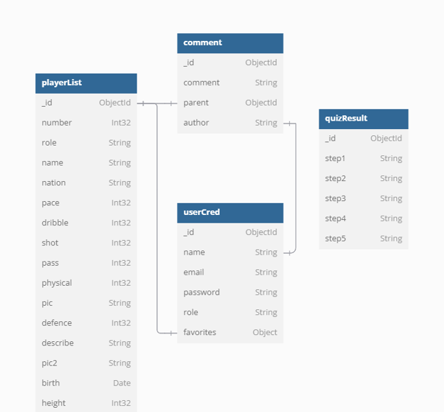

# ALLTHATARSENAL

### NEXT.js를 활용한 아스날FC 팬 페이지

<!--  -->

## 📝 프로젝트 소개

NEXT.js를 활용한 아스날FC 팬 페이지입니다. 여러 토이 프로젝트를 하였지만 대부분 단편적으로 끝나는 경우가 많았고, 그 프로젝트를 더 이상 디벨롭하지 못해 아쉬웠던 경험이 있었습니다. 하나의 서비스를 만든다라고 생각하고, 제가 학습한 것들로 꾸준히 코드 개선을 하려는 의도로 프로젝트를 시작하였습니다.

## 🛠️ 기술 스택

<!--
  Shield.io 배지 양식

  

  - 라벨: 임의의 이름
  - 색상: https://simpleicons.org/ 에서 검색한 로고의 색상코드 (# 제외하고 입력)
  - 배지 스타일: plastic, flat, flat-square, for-the-badge, social 중 하나 선택
  - 로고 이름: https://simpleicons.org/ 에서 검색한 로고의 이름
  - 로고 색상: 로고의 색상코드
-->
<p>
<!-- npm -->

<!-- NEXT.js -->

<!-- ReactQuery -->

<!-- NextAuth -->

<!-- NEXTUI -->

<!-- MongoDB -->

<!-- Typescript -->

<!-- Recharts-->

<!-- emotion -->

<!-- Vercel -->

<!-- Swiper -->

<!-- Fullcalender -->

</p>
  <!--  -->
  
## 🆕 구현 기능

<!--  -->

#### 1. NextAuth를 활용한 회원가입 및 로그인&로그아웃 기능.
 회원가입및 이메일 중복검사 클라이언트와 서버단에서 비밀번호 유효성검사 시행. API route로 DB에 전달. NextAuth를 활용하여 로그인과 로그아웃 기능 구현.

#### 2. mongoDB에서 선수 목록 출력 및 선수별 정렬
데이터 베이스는 mongoDB로 관리. 선수데이터, 유저정보 및 댓글 저장.선수데이터, 유저정보등은 NEXT.js에서 직접 데이터 페칭

#### 3. 선수 상세 정보 출력 및 선수당 댓글 출력,작성,수정,삭제기능 구현.
데이터의 변화가 적은 선수 정보,로그인은 NEXT.js에서 직접 데이터 페칭,각 선수별 댓글,즐겨찾기와 기능은 server state로 관리하기 위해 TanstackQuery를 활용하여 데이터페칭.

#### 4. Recharts를 활용한 선수간 스탯 비교 기능 구현
NEXT.js에서 가져온 선수 스탯 데이터를 Recharts로 시각화하여 선수간 스탯비교 기능을 구현.또한 Recharts는 선수 상세페이지에서도 사용

#### 5. FullCalendar와 fobmobAPI를 활용한 경기 일정관리.
fobmobAPI의 경기일정 데이터를 FullCalendar로 구현하여 경기일정을 시각화.

<!--  -->
<br />

## 🔃 프로젝트 흐름도


## 💿 데이터 베이스



<!--  -->

## 🕹️ 실행 방법

```sh
$ git clone https://github.com/theo-jin/allthatarsenal.git
$ npm install
$ npm run dev
```

<!--  -->
<br />

## 🔗 배포 링크

https://allthatarsenal-orbi.vercel.app/

<!--  -->
<br />

## 🖱️ 기능

#### 테스트를 위해 로그인하시길 바랍니다.

```
id:asdf@asdf.com
pw:asdfasdf
```

### SwiperReact를 이용한 스크롤


### mongoDB에서 선수 목록 출력 및 생성및 선수별 정렬


### fobmobAPI와 Fullcalender를 통한 일정표시


### Recharts를 활용한 선수간 스탯 비교 기능 구현


